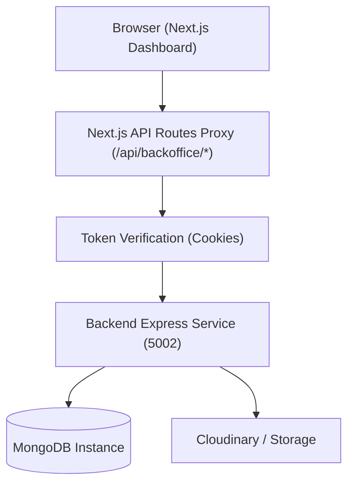

# Souk El Fellah Backoffice 🖥️

A modern, high-performance, and beautifully styled administration panel for the Moroccan agricultural marketplace (**سوق الفلاح**). Built using Next.js 15 (App Router), React 19, TailwindCSS, TypeScript, Radix UI primitives, and TanStack React Query (v5).

This portal allows administrators to curate reference database tables, moderate user listings, review user reports, dispatch push notifications, and monitor audit logs.


---

## 🏗️ Portal Architecture & Routing

The backoffice portal utilizes the **Next.js App Router** structure, maintaining pages under `/app/admin/...` and proxying API endpoints through custom Next.js Route Handlers under `/app/api/...`.



### Main Administrative Modules
1.  **Dashboard overview**: Aggregates statistics (total listings, registered users, reports pending review) and formats data using visual charts.
2.  **Categories CRUD** (`admin/categories`): Directory administration (create, list, inline edit names and icons, toggle active status, and delete). Includes a custom drag-and-drop file upload zone for icons.
3.  **Product Types CRUD** (`admin/product-types`): Specific agricultural sub-categories (e.g. Olive oil vs table olives) and configures their allowed measurement units.
4.  **Measurement Units CRUD** (`admin/measurement-units`): System-wide units of trade (e.g. Kg, Box, Ton, Head, Qintar).
5.  **Listings Moderator** (`admin/listings`): Tracks and controls items posted to the marketplace (Active, Sold, Paused, Rejected).
6.  **User Administration** (`admin/users`): Controls user accounts, toggles active flags, and adjusts permissions/roles (Admin, User).
7.  **Location Hierarchy Directory** (`admin/locations`): Visualizes administrative regions and provinces mapped with GeoJSON coordinate centers.
8.  **Flagging & Reports Review** (`admin/reports`): Moderates reported or fraudulent listings, resolving or dismissing flags.
9.  **Real-Time Notifications Portal** (`admin/notifications`): Allows admins to review sent microservice messages or dispatch custom bulk marketing campaign pushes to users.
10. **System Versioning** (`admin/versions`): Tracks mobile app bundle release parameters.
11. **System Audit Logs** (`admin/audit-logs`): Full ledger tracking modifications.

---

## 📂 Project Directory Structure

```text
soukelfellah-backoffice/
├── app/
│   ├── admin/               # Admin pages (Dashboard, categories, listings, users...)
│   ├── api/
│   │   ├── backoffice/      # Next.js Server Route Handlers proxying requests to the backend
│   │   │   └── files/       # File Upload (uploads) and Delete ([id]) proxy routes
│   │   └── files/           # Image file viewer proxy
│   ├── login/               # Authentication page container
│   ├── globals.css          # TailwindCSS directives and design system tokens
│   ├── layout.tsx           # Global HTML/Head wrapper and viewport configurations
│   ├── providers.tsx        # React Query Client and Theme configurations
│   └── page.tsx             # Root route redirect resolver
├── components/
│   ├── shared/              # Reusable elements (DataTable, States, FileUpload component)
│   ├── shell/               # Core layout shells (Sidebar navigation, Topbar profile)
│   └── ui/                  # Radix UI style abstractions (Button, Input, Card, Labels)
├── lib/
│   ├── api.ts               # Axios Server requests handler with Auth retry interceptors
│   ├── client-api.ts        # Client-side Axios instance pointing to /api/backoffice base
│   ├── types.ts             # TypeScript entity definitions (Category, Listing, User)
│   └── utils.ts             # Style merges and class utilities
├── public/                  # Static assets and icons
├── tailwind.config.ts       # Tailwind CSS design guidelines configuration
└── tsconfig.json            # TypeScript rules
```

---

## 🛡️ Transactional File Upload Design

To maintain data integrity and prevent broken links:
1.  **Local-Only Delete previews**: In the `<FileUpload>` component, clicking "X" on an uploaded category icon preview only removes it from the UI component state. No immediate HTTP deletion call is triggered.
2.  **Delete on Commit (Save)**: If the user changes the icon and clicks **Save**, the backend controller compares the changes, writes the new reference, and calls `deleteFileById` to permanently erase the old file from Cloudinary/local disk storage and the DB. If the user cancels the form, the file remains secure, preventing broken images.

---

## ⚡ Setup & Launch Guide

### 1. Prerequisites
Ensure you have `Node.js` v20+ installed on your computer.

### 2. Environment Configuration
Create a `.env` file in the root directory:
```env
# Point to your local backend API gateway
NEXT_PUBLIC_API_URL=http://localhost:5002
```

### 3. Start Development Portal
*   **Install dependencies**:
    ```bash
    npm install
    ```
*   **Start the hot-reloading development server**:
    ```bash
    npm run dev
    ```
    The application will start at `http://localhost:3000`.

### 4. Build Production Bundle
To create an optimized production build:
```bash
npm run build
npm start
```

### 5. Code Linting & Type Safety
To check for ESLint issues and TypeScript compilation errors:
```bash
npm run lint
# and
npm run typecheck
```
